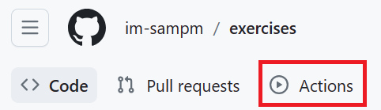
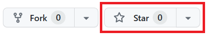

<header>

# Teradyne GitHub Training Platform

</header>

## Welcome

Welcome to the Teradyne GitHub Training Course!

This course accompanies the [Teradyne GitHub Training Guide](https://im-github-training.github.io/) and contains a series of exercises designed to introduce the following Git concepts: In this tutorial, we'll cover the basics of Git and GitHub by working through a series of exercises.  We'll start with the basics of creating a repository, working with branches, and making commits.  From there, we'll cover more advanced topics such as merging, rebasing, and pull requests.

### Prerequisites

To complete this course, you will need a basic understanding of the terminal (or command line).  If you're new to the terminal, we recommend checking out [Codecademy's Command Line Course](https://www.codecademy.com/learn/learn-the-command-line).

You'll also need to have Git installed on your machine and a GitHub account.  If you need help with this, please see:

* [Setting up Git](https://im-github-training.github.io/#/./docs/getting-started/setting-up-git)
* [Setting up GitHub](https://im-github-training.github.io/#/./docs/getting-started/setting-up-github)

### Recommended Reading

We recommend reading the following sections of the [Teradyne GitHub Training Guide](https://im-github-training.github.io/):

* [What is Git?](https://im-github-training.github.io/#/./docs/basic/git/what-is-git)
* [What is GitHub?](https://im-github-training.github.io/#/./docs/basic/github/what-is-github)
* [What is a Repository?](https://im-github-training.github.io/#/./docs/basic/git/repositories)
* [What is a Branch?](https://im-github-training.github.io/#/./docs/basic/git/branches)
* [What is a Commit?](https://im-github-training.github.io/#/./docs/basic/git/commits)

### How to start this course

1. Right-click **Start course** and open the link in a new tab.
2. In the new tab, most of the prompts will automatically fill in for you.
    * For owner, choose your personal account or an organization to host the repository
    * Check the "Copy the `main` branch only" box
    * Scroll down and click the **Create fork** button at the bottom of the form
3. After your new repository is created, click on the **Actions** tab in your forked repo.
    
4. Click on **"I understand my workflows, go ahead and enable them"**
5. Finally, click on the "Star" button to Star your Repo
    
6. After your repository is starred, **wait about 20 seconds**, then refresh the page.
7. Follow the step-by-step instructions in the new repository's README.

<footer>

&copy; 2024 Teradyne &bull; [Code of Conduct](https://www.contributor-covenant.org/version/2/1/code_of_conduct/code_of_conduct.md) &bull; [MIT License](https://gh.io/mit)

</footer>
